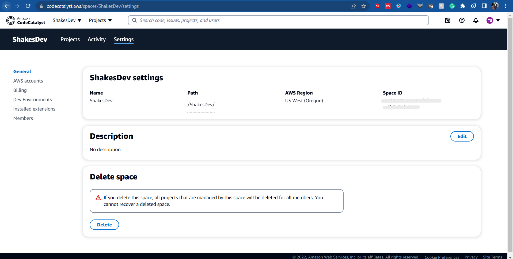
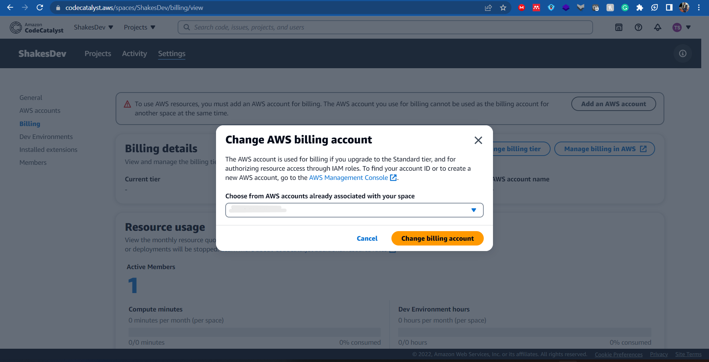

In the current day and age, teamwork and collaboration is becoming increasingly important as technical teams become highly specialized. This is further evidenced by the unprecedented growth and embrace of agile teams, project management and program management. Dev(Sec)Ops has become the order of the day for development and operation teams to easily work together and break down silos.  
However, building applications in an effective and efficient way requires native CI/CD tools that support these methodologies and are able to extend their functionality to specialized third-party tools that handle issue management. 

This article takes you on an exiciting journey on how to leverage Amazon CodeCatalyst from AWS and Jira from Atlassian to build a Modern CI/CD pipeline with Issue Tracking. 

## Getting started

By the end, we will have:

* Installed and configured a Jira Software Extension on an Amazon CodeCatalyst Project
* Update an Issue on a CodeCatalyst project and view the status in Jira Issues 

Although this is not covered in this article, once you have Amazon CodeCatalyst set up with Jira Issues you will also be able to: 
* Update Jira issues with CodeCatalyst pull requests
* View status and workflow runs of linked CodeCatalyst pull requests in Jira issues

## Prerequisites
As a prerequisite, we will need:

* Basic knowledge of navigating between AWS Services
* Active AWS Account
* Free AWS Builder ID
* Free Amazon CodeCatalyst Account
* Active Jira Site (Note: CodeCatalyst is only compatible with Jira Software Cloud.)

Let’s get rolling!

## Modern CI/CD Architecture on Amazon CodeCatalyst

The following architecture provides an overview of all the AWS resources and services that are used in creating a turnkey morern CI/CD pipeline on Amazon CodeCatalyst

### Step 1: Log in to Amazon CodeCatalyst using your AWS Builder ID

You create your AWS Builder ID when you sign up for one of the AWS tools and services that use it. Amazon CodeCatalyst is one of those tools.

`Do remember that having an AWS Account does not necessarilty mean that you already have an AWS Builder ID.` 

Navigate to the Amazon CodeCatalyst Log in Page [Amazon CodeCatalyst Log In Page ](https://codecatalyst.aws/login) 

Amazon CodeCatalyst will automatically Navigate you to the AWS BuilderID Sign Up Page as shown :

You will provide your email, click next and a new page will appear where you will be required to provide your name (This is the name that will appear to other users).

After providing your name, you will go through an email verification and password set up process and you will hav your AWS Builder ID created. 

`The AWS Builder ID you just created is what you will use to log in to Amazon CodeCatalyst.`

### Step 2: Create and Configure a CodeCatalyst Space and Project from a Blueprint

* Quick Primer on Spaces, Projects and Blueprints

Consider a CodeCatalyst Space as a logical grouping on CodeCatalyst that can be used to represent a Company if it is small. Several Spaces can represent departments or groups in a large organization.

 `From experience mine my space initialized without a tier and had to contact AWS Support to assist me to resolve this. Same case happened to a fellow builder. So make sure you check your current tier after you link it with your AWS Account and verify your space on the AWS Management Console` 

A CodeCatalyst Project as a collaborative effort in CodeCatalyst that supports development teams and tasks with shared continuous integration/continuous delivery (CI/CD) workflows and repositories.

You can initialize projects using your own code from a CodeCommit, GitHub or Bitbucket Repository. The AWS team continuously develop and update CodeCatalyst Blueprints that synthesize projects and generate projects for you using the base configuration specified by the blueprint.

 `For this particular tutorial you will use a CodeCatalyst Blueprint to create a React Web Application Project which you can customize further.` 

Phew, that was quite a primer. Now that you understand what a Space, Project and a Blueprint is on CodeCatalyst let's proceed and create them. 

After you have successfully logged in to Amazon Codetalyst from Step 1, CodeCatalyst will take you on an Onboarding journey consisting of the following:

* Create your CodeCatalyst Alias which will be part of your profile on all of CodeCatalyst and used to mention you when collaborating on projects for example on a Kanban Board. 

`Your CodeCatalyst alias needs to be unique, does not allow spaces and CANNOT be changed after creating them.`

CodeCatalyst Onboarding - Create your Alias Page :

* After creating your alias, you need to create the space where your projects will live in. 

`Spaces can be used to store and manage projects and are free to use on AWS. However it is important to note that Spaces are initialized on the Free Tier`

CodeCatalyst Onboarding - Create your Space Page :

* Once your Space is ready, you need to link an AWS Account to handle billing and deployments. 

`You need to only enter an AWS Account ID you can access and has the appropriate permissions to access CodeCatalyst otherwise you will be unable to verify on the AWS Console.`

In case you don't have an AWS Account you can create an [Free Tier AWS Account here:](https://aws.amazon.com/free/) 

CodeCatalyst Onboarding - Link your AWS Account to CodeCatalyst Page :

CodeCatalyst Onboarding - Verify the Amazon Codecatalyst space from your AWS Account :

### Step 3: Set up and test your CodeCatalyst CI/CD Pipeline

* After a successful CodeCatalyst Onboarding, you need to establish the CI/CD pipeline on CodeCatalyst and test the Workflow to confirm that the Build, Test and Deploy steps complete successfully. 

Navigate to the Amazon CodeCatalyst Create Project Page within the space if you have created several spaces,

`Do remember that each space needs to be linked to the relevant AWS Account for the Deployment of the Project to be successfull.` 

Once you have navigated to the Create Project page within CodeCatalyst, you are presented with three options to start your project.

* Start with a blueprint - Leverage a template with sample code and ability to create project resources on your behalf 
* Bring your own code - Link a code hosted in a Code Repository such as Github
* Start from Scratch - An empty project with no resources is created for you to pupulate it with code and the project resources

Amazon CodeCatalyst Create Project 

#### Option 1: Start with a blueprint
When you select a Blueprint you can choose from a collection of blueprints developed by the CodeCatalyst Team, for simplicity you can select the Single-Page Application Blueprint for this guide

Single-Page Application Blueprint 

Enter the Project Name and scroll down to the Project Resources section where you select the AWS Account ID connected to the Space. You can also add a new AWS Account using the Add an AWS Account link.

Single-Page Application Project Name and Project Resources 

It's also in this section where you specify the IAM role needed for CodeCatalyst to et the needed perimission to different AWS Services such as Cloudformation and Amplify to create the infrastructure and deploy the application. 

You can click the View Role Requirements to view the Trust Policy and Inline Policy JSON for review and role creation within IAM. 

Single-Page Application - IAM Role Requirements 

Within the same page, expand the Additional configurations section and review the selections for th Web Application Framework, Hosting and CDK Programming Language. 

For the purpose of this guide you can confirm that you will use the React Framework, Amplify Hosting and Typescript as the CDK Programming language. 

You also have the option of selecting the AWS region where your application will be deployed as well as customize the Repository name and the name Cloudformation Stack that will be created to avail the resources needed to deploy the React Web Appliation.

Single-Page Application - Additional Configurations 

You also have the option to review the YAML files used to set uo the CI/CD pipeline visually or as YAML code from the Right Side Panel as shown. 

Single-Page Application - YAML 

Click Create Project and in a few minutes you will be able to start customizing your project

Single-Page Application Creation 

`You may encounter an error while creating your project regarding the Space not having a billing tier. This may happen even after associating your account. One workaround is to write to AWS Support who can resolve it from their end by adding the Space to the free tier.A response I have received previously is that there is a certain level of account usage required for you to be able to use both the Free Tier and the Standard Tier on CodeCatalyst. ` 

Space Settings 

To associate an AWS Account to the Space as an AWS Billing Account:
Navigate to Space Settings on the left Navigation Pane, Click Billing:

Space Settings 

Under Billing details, you should see an active AWS account under a Free or Standard Tier. If the section is blank as shown then you need to change the billing tier by clicking on Change Billing Tier

Billing Details 

When you Click on Change Billing Tier you will choose an AWS Account from the AWS Accounts already associated with your space. 

Billing Details 

After choosing the AWS Account a successful update of the Billing Authorization will appear on your AWS Account. 

Billing Authorization on your AWS Account 

Once you have successfully associated an AWS Billing account you can repeat the Project creation steps and the Project will be succesfully created. 

#### Option 2: Bring your own Code
When you select to Bring your Own Code you are presented two dropdowns. In one dropdown you select the GitHub account, the account must have already been linked to the Space. In case you have nit linked any GitHub account to the Space, select the "Connect to a GitHub Account" link.

Codecatalyst - Bring your own code 

To connect a GitHub Account, navigate to Space Sessings, Installed Extentions and Coose Connect GitHub account. Once you complete that process ypu should be able to view your accoynt under the Connected GitHub accounts section.

Codecatalyst - Connected GitHub Accounts 

In this guide, the public GitHub repository for a React-based Book Application is used. The Project Overview has two sections where you can view the repository on GitHub and an overview of Worklow runs for your CI/CD pipeline. 

Since this is a new repository yor workflow runs will have no workflows. 

Codecatalyst - Project Overview 

Click Create Workflow and select the Source Repository and the Branch and choose Create. 

Codecatalyst - Create Workflow 

For the Build stage you will be required to specift the environment. To create an environment you can navigate to the Environment and Create a Non-Production Environment. 

Codecatalyst - Environment Details 

On the workflow page you can configure the paremeters for the Build and Deploy stages including the Environment and the Runtime. In this guide you will leverage a Non-production environment and DeploytoAWSAmplifyHosting for the Build. Confirm that the workflow definition is valid by clicking Validate.

Codecatalyst - Validate Workflow 

Commit the Workflow and the initial Workflow Run will be automatically initiated deniting that the CI/CD Pipeline is now set up. 

Codecatalyst - Workflow Run 

You can revise or stop the workflow at any time by selecting the Edit Workflow or Stop button. 
Codecatalyst - Workflow Update 

## Connect Jira Issues

CodeCatalyst offers native Issue management however you might want to extend the capabilities of Issue Management when working in team projects by leveraging Atlassian's Jira Issues. 

### Step 4: Connect your Jira sites to your CodeCatalyst space 

The next step to connect your Jira Sites is to install Jira Software extension to your CodeCatalyst space.

### Link your Jira issue to a CodeCatalyst Pull Request

You also have the ability to link your Jira Issue to a CodeCatalyst Pull Request. Although this is beyond the scope of this guide, check this AWS Documentation Article for more information on [working with pull requests in Amazon CodeCatalyst](https://docs.aws.amazon.com/codecatalyst/latest/userguide/source-pull-requests.html)

### Step 6: Link your Jira project to your CodeCatalyst project

### Step 7: Confirm the CodeCatalyst Workflow Events in your Jira Issue

## Clean Up the Resources

Now that you’ve finished building a modern CI/CD pipeline on Amazon CodeCatalyst, you can delete all resources from Amazon CodeCatalyst and your AWS Account.

To delete the resources:

* Go to AWS Cloud formation and delete the stack associated with the project that was depoyed by CodeCatalyst
* Delete your CodeCatalyst Project 
* Unlink the repository from the Codecatalyst Space * Remove your AWS Account from the CoredeCatalyst Space

## Conclusion

Congratulations! You have built a Modern CI/CD Pipeline Complete with Jira Issue Tracking on Amazon CodeCatalyst. You can explore further on how you can integrate your own code from CodeCommit or other source Providers such as GitHub and BitBucket.

If you want to learn more about Amazon CodeCatalyst, you can check out the following blog posts:

* [AWS re:Invent 2022 - Introducing Amazon CodeCatalyst](https://www.youtube.com/watch?v=mKdGehrUYFI)
* [AWS Developer Innovation Day | AWS On Air ft. Team up without the friction with Amazon CodeCatalyst ](https://www.youtube.com/watch?v=fTK_7l8md1M)
* [Amazon CodeCatalyst User Guide - AWS Documentation ](https://docs.aws.amazon.com/codecatalyst/latest/userguide/welcome.html)
* [Amazon CodeCatalyst Workshop](https://catalog.us-east-1.prod.workshops.aws/workshops/23fa5676-2943-415b-98b9-125f5e86912d/en-US)

If you found this guide helpful, we appreciate your feedback and in case you end up facing any challenges, we are here for you, please send it our way